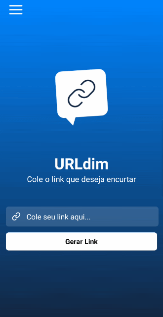
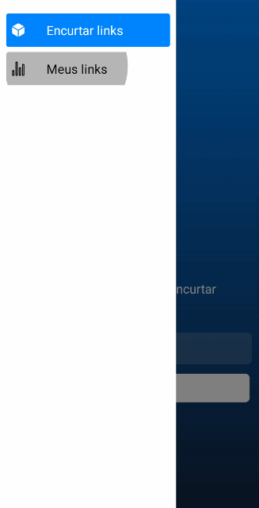

<h1 align="center">
    
</h1>

<h1 align="center">URLdim</h1>

 O URLdim é uma aplicação que tem como finalidade encurtar o link que você colocar nele, e compartilhá-lo através das mais variadas opções. Ele foi desenvolvido durante a semana React Native Insider 3

 <a href="https://github.com/clefersondannylo/URLdim/stargazers">
</a>

  <a href="#objetivo">Objetivo</a> •  <a href="#roadmap">Roadmap</a> •   <a href="#tecnologias">Tecnologias</a> •   <a href="#contribuicao">Contribuição</a> •   <a href="#licenc-a">Licença</a> •   <a href="#autor">Autor</a> 

    
    

## 

<h4 align="center">  🚧   Em construção...  🚧 </h4>

      

\### Features

- [x] Encurtar link
- [x] copiar o link encurtado
- [x] Compartilhar o link através de aplicativos
- [ ] Sistema de Login

 

[Expo](https://github.com/expo/expo)

[Styled Components](https://www.styled-components.com/)

[Layout no Figma](https://www.figma.com/file/7JMmKL0T6qbjYfLFTLL3Vo/Sujeito-programador---Insider-3.0---sujeito-link)

